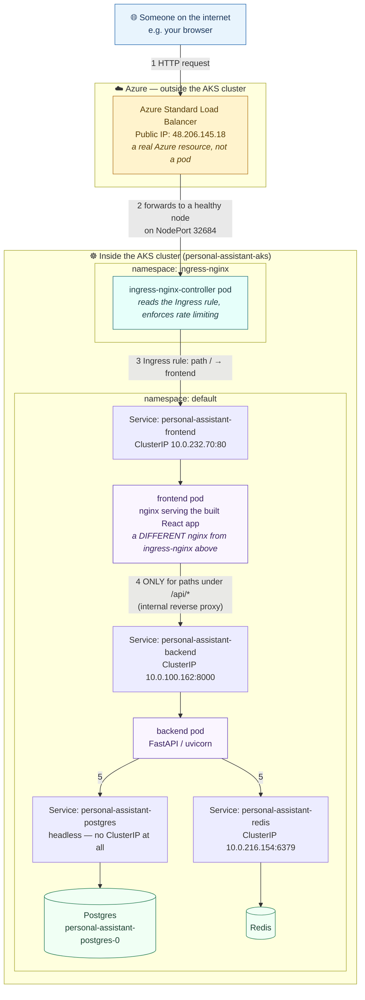
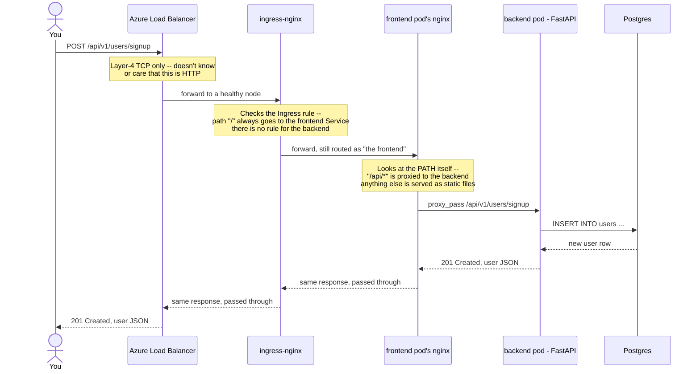

# Architecture: how a request from anywhere reaches this app

This explains, in order, everything that happens between "someone types
`http://48.206.145.18/` in a browser" and "they see the app." Every name,
IP, and port below is real and current for this deployment — check with
the commands at the bottom if anything's been redeployed since.

## The big picture



**Two things this diagram is deliberately showing, that are easy to miss:**

1. **The Load Balancer box is drawn *outside* the "Inside AKS cluster" box, on purpose.** It's a real, separate Azure resource — not a pod, not part of the cluster. More on this below.
2. **`ingress-nginx` and the `frontend` pod's nginx are two completely different programs**, running in different pods, doing different jobs. Seeing "nginx" twice in this diagram is not a mistake.

Postgres and Redis have **no arrows coming in from outside the `AKS` box at all** — there's no path to them except from the backend pod, on the cluster's internal network. Nothing external can ever reach them directly, no matter what URL is tried.

## Walking one real request, step by step

This is the exact same picture as above, but drawn as a *sequence* — who
talks to whom, **in order**, for one concrete request:
`POST /api/v1/users/signup`.



The takeaway: **the Ingress never actually looks at `/api/`** — it only
ever sees `/`, because that's the only rule that exists. The real
frontend-vs-backend decision happens one step later than most people
expect, inside the frontend pod itself.

## Is the Load Balancer inside AKS, or outside?

**Outside.** It's a genuine, separate Azure resource
(`Microsoft.Network/loadBalancers`) — not a pod, not a container, nothing
running as part of the Kubernetes cluster. Verified directly:

```bash
$ az group list --output table
personal-assistant-registry                                    eastus
personal-assistant-learning                                    eastus   <- our Terraform-managed RG
MC_personal-assistant-learning_personal-assistant-aks_eastus   eastus   <- AKS's own auto-managed RG

$ az network lb list --resource-group MC_personal-assistant-learning_personal-assistant-aks_eastus --output table
Name        ResourceGroup
----------  --------------------------------------------------------------
kubernetes  mc_personal-assistant-learning_personal-assistant-aks_eastus
```

It lives in `MC_*` — AKS's own auto-managed resource group, completely
separate from `personal-assistant-learning` (the one our Terraform
actually owns, holding just the AKS cluster *resource*, the VNet, and one
role assignment). AKS creates this second resource group automatically to
hold every piece of *real infrastructure* the cluster needs: the VM(s)
themselves, this Load Balancer, the public IP, network cards, and the
disks backing Postgres's storage.

**But it exists *because of* something inside Kubernetes.** Nobody ran
`az network lb create` by hand. AKS's control plane runs a component
called the **cloud-controller-manager**, which watches for any Kubernetes
`Service` declared `type: LoadBalancer` — that's exactly what
`ingress-nginx-controller`'s Service is — and automatically creates a real
Azure Load Balancer to satisfy it. This isn't Azure-specific: EKS does the
same thing with a real AWS ELB/NLB, GKE with its own LB. It's the general
pattern every managed Kubernetes offering uses to connect a portable
Kubernetes idea (`type: LoadBalancer`) to whatever the cloud actually has.

## Two separate IP ranges, and why that's intentional

```bash
$ kubectl get nodes -o wide      # node's IP: 10.10.1.4    (a real VNet address)
$ kubectl get pods -o wide       # pod IPs:   10.244.0.x   (a totally different range)
```

The node's IP (`10.10.1.4`) comes from the VNet Terraform created
(`10.10.0.0/16`, subnetted to `10.10.1.0/24`). The pods' IPs
(`10.244.0.x`) come from something else entirely: AKS's default pod
network. This cluster uses **kubenet**, which gives every pod an address
from a separate overlay range that has nothing to do with the VNet. The
node quietly translates traffic between the two ranges as it comes and
goes. (The alternative, Azure CNI, gives every pod a real VNet address
instead — at the cost of eating one VNet IP per pod, which matters on a
small `/24` subnet like this one. That's why kubenet was chosen here.)

## No domain, no HTTPS yet — a deliberate choice, not an oversight

Access today is plain `http://48.206.145.18/`. Getting real HTTPS needs a
domain name pointed at this IP first (for `cert-manager` + Let's Encrypt
to issue a certificate for it) — that wasn't available when this was set
up, so HTTP-only was chosen deliberately as the starting point. Adding it
later doesn't change any of the architecture above — it slots into the
`ingress-nginx` layer (step 3 in the sequence diagram) as a
`cert-manager` install plus a `tls:` block on the existing Ingress.

## Quick verification commands

```bash
kubectl get svc -A                              # every Service + its ClusterIP/type
kubectl get ingress -o yaml                      # the actual routing rule + rate-limit annotations
kubectl get pods -o wide                         # pod IPs, which node they're on
kubectl get nodes -o wide                        # the node's real VNet IP
kubectl get svc -n ingress-nginx ingress-nginx-controller   # the public IP, live
```
